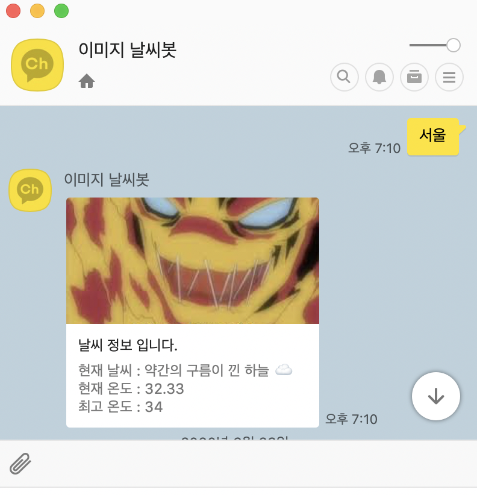
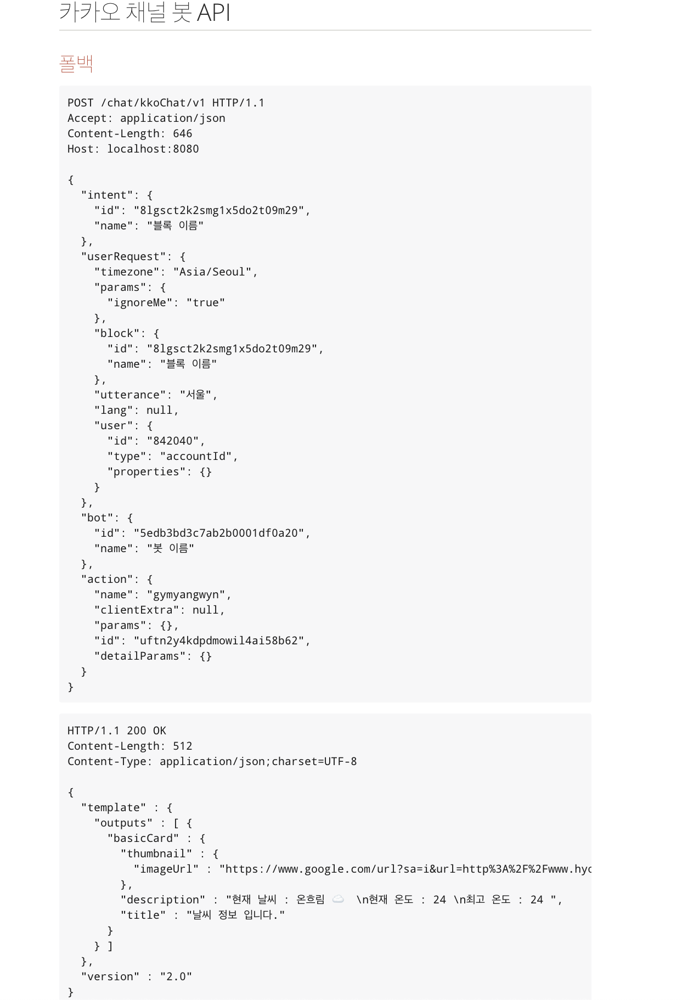

# 카카오채널 날씨 챗봇


[](https://github.com/sura121/S-ChatBot) []() []() []()

개요
===

spring boot 공부를하기 위해서 toy project 진행을 위해서 간단한 카카오 채널봇을 만들었습니다. 
개인적으로 프로젝트를 진행하면서 이전에 알지 못했던 부분을 깊이 있게 공부하게된 좋은 개기가 된거 같습니다.

개발환경
==
- IntelliJ IDE
- Spring Boot 2.1.1


API Flow
==
 
 
 
프로젝트 설명
==
 카카오 오픈빌더를 이용해 사용자가 요청한 도시 날씨를 알려주는 채널을 만들었습니다. 
오픈빌더 내에 스킬서버를 이용해 발화코드 작성 및 요청에 대한 응답 서버를 구현했습니다. 구현 중에 필요한 날씨 open API를 이용해서 작업을 진행했습니다. 
open weather API에서 도시명 또는 위도, 경도에 대한 parameter를 가지고 날씨정보를 알려주는 API 중 위도, 경도로 날씨 정보를 가져오는 API를 사용하였습니다. 
  위도, 경도에 대한 API를 사용하게 된 이유는 **google geocoding** API를 한 번쯤은 사용해보고 싶었기 때문에 번거롭지만 2번 호출하는 방식으로 설계하게 되었습니다.
  
1. 시나리오 작성
    --
    1. 카카오 오픈빌더에서 시나리오 작성을 했습니다.
        - 웰컴 블록에서 인사말에 대해서 발화내용을 묶어서 채널봇에서 메시지를 리턴할 수 있도록 설정 하였습니다.

2. 스킬서버 
    --
    1.  스킬서버를 적용하기 위해 AWS EC2 t2.micro instance 사용을 했습니다.
        Linux
    2.  오픈빌더내에 스킬 메뉴에서 endpoint를 넣은 후에 도시명을 입력하면 스킬서버에서 날씨 메시지를 리턴 하게 됩니다.
    
    3.  카카오 채널 request 
```json
{
  "intent": {
    "id": "**",
    "name": "블록 이름"
  },
  "userRequest": {
    "timezone": "Asia/Seoul",
    "params": {
      "ignoreMe": "true"
    },
    "block": {
      "id": "**",
      "name": "블록 이름"
    },
    "utterance": "서울",
    "lang": null,
    "user": {
      "id": "**",
      "type": "accountId",
      "properties": {}
    }
  },
  "bot": {
    "id": "**",
    "name": "봇 이름"
  },
  "action": {
    "name": "gymyangwyn",
    "clientExtra": null,
    "params": {},
    "id": "**",
    "detailParams": {}
  }
}
```
 - 위와 같이 json 형태로 요청이 오는데 해당 요청을 스킬서버 Controller에서 좀더 쉽게 사용하기 위해
 requestHandler에서 미리 가공을 하고 넘어오게 설계 했습니다. 이렇게 설계 하게된 이유는 동일코드의 사용을 줄이기 위해서도 있지만
 프로젝트를 진행하면서 유지보수의 관리포인트를 줄이고자 하는 생각이였습니다.
 
 - 여기서 filter, interceptor, AOP 중 어떤 부분을 사용하면 좋을지 고민하다가 세개의 차이점에 대해서 
 명확히 알게되었습니다.
  
 [GithubBlog](https://sura121.github.io/develog/AOP,-FILTER,-INTERCEPTOR-%EC%B0%A8%EC%9D%B4-%EB%B0%8F-%EC%82%AC%EC%9A%A9/ "개인 블로그 링크"")
 
스킬서버 Response
-
 - 스킬서버에서 Kakao 오픈빌더에 응답별 Json포맷에 맞게 리턴 메시지를 보내줍니다.
```json
{
  "template" : {
    "outputs" : [ {
      "basicCard" : {
        "thumbnail" : {
          "imageUrl" : "https://www.google.com/url?sa=i&url=http%3A%2F%2Fwww.hyonews.com%2Fxe%2F72556&psig=AOvVaw163gj31uoUK_WQ-ic1MgUd&ust=1592459601895000&source=images&cd=vfe&ved=0CAIQjRxqFwoTCMjsw7mUiOoCFQAAAAAdAAAAABAR"
        },
        "description" : "현재 날씨 : 온흐림 ☁️  \n현재 온도 : 24 \n최고 온도 : 24 ",
        "title" : "날씨 정보 입니다."
      }
    } ]
  },
  "version" : "2.0"
}
```



 API 명세를 위한 Rest Docs 도입
 ==
-  **Rest Docs 도입 이유**
    - 이전 프로젝트에서 swagger를 사용해보았습니다. 다른 문서 자동화를 찾다가 restdocs를 적용해보았습니다.   
- **차이점**
    
    - 제가 사용해보면서 제일큰 장단점은 릴리즈되는 코드와 동기화 된다 안된다가 제일큰 차이점인거 같습니다.
    문서화를 계속 진행하게 된다면 코드 수정시 마다 swagger를 업데이트 해야되지만 단위 테스트를 진행하면서 개발을 하게되면
    Rest Docs는 최신화를 유지 할 수 있다는게 큰 장점인거 같았습니다.
    
    
| | Rest Docs | Swagger| 
|---|---|---|     
| 장점 | 테스트가 성공해야 문서가 작성된다.| 테스트를 할 수 있다 / 적용하기 쉽다.| 
| 단점  | 적용하기 어렵다 | 코드와 동기화가 안될 수 있다.    |

Rest Docs 적용
-


추가 및 보완 사항
===
 현재 개발을 진행하면서 속도가 더디더라도 클린코드와 적용하고싶은 부분을 확실히 진행하고 싶습니다.

- 웰컴 블록, 탈출 블록에 대한 스킬서버 지정 
- 발화 메시지에대한 AI 학습 추가
- TDD 및 API 문서화를 진행하기 위한 Rest Docs 활용 추가
- 도메인 모델 재설계


 
 
 


 